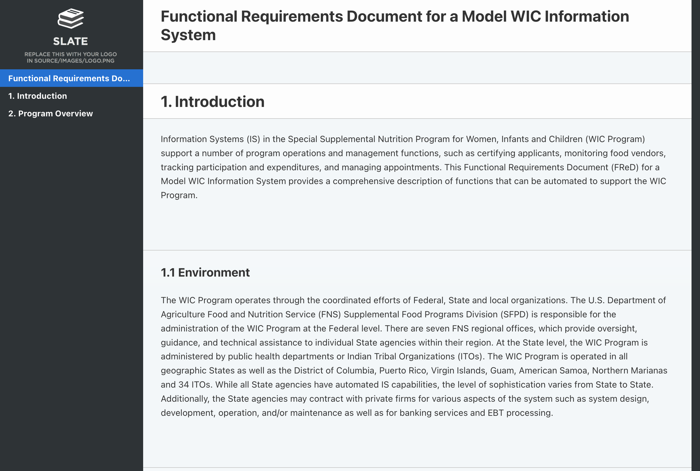

# Testing FReD in Slatedocs

An fast-and-dirty example implementation of [the FReD](https://fns-prod.azureedge.us/sites/default/files/apd/FReD-v2.0-Final.pdf) (PDF) converted to [Slatedocs](https://github.com/slatedocs/slate).



## Build

Uses the `slatedocs/slate` docker image to run slate on the content in this repo, site output will be in `./build`.

```shell
$ make build
```
